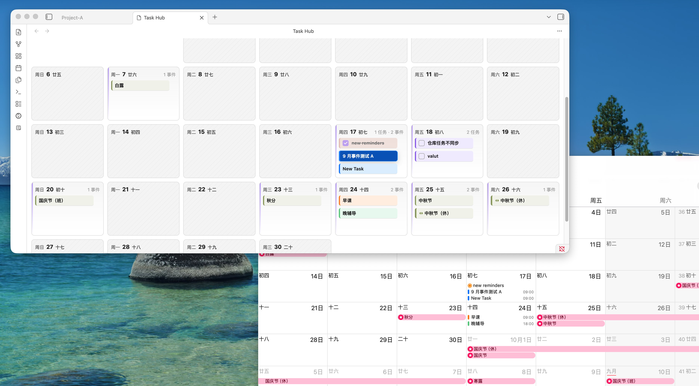

# Task Hub

[English](README.md) | [简体中文](README.zh-CN.md) | [日本語](README.ja.md) | [한국어](README.ko.md) | [Français](README.fr.md) | [Español](README.es.md)

Task Hub は、Obsidian デスクトップ専用のタスク集約プラグインです。Vault 内の Markdown タスク、Apple Reminders、Apple Calendar イベント、公開 ICS カレンダー、Dida/TickTick タスクを 1 つのワークスペースにまとめます。

日次ノート、会議メモ、プロジェクトノート、資料ノートにタスクを書き散らしていても、1 か所で確認、絞り込み、日付変更、安全な更新をしたい人向けです。

## Task Hub が必要な理由

Task Hub は Markdown タスクを元のノートに残したまま、専用のタスク作業台を提供します。すべてのタスクを別のタスク管理アプリへ移さなくても、期限、出典ファイル、関連タグを確認できます。

次のような使い方に向いています。

- Vault 全体の `- [ ]` と `- [x]` タスクを集める。
- タスクから元ノートを開き、元の行付近へ移動する。
- リスト、カレンダー、タグからタスクを確認する。
- 日付付きタスクと対応するリマインダー/カレンダーソースを一緒に見る。
- 外部ソースへの書き戻しを明示的なオプトインにする。

## 主な機能

- `- [ ]` と `- [x]` 形式の Markdown タスクを索引化。
- `📅 YYYY-MM-DD`、`due:: YYYY-MM-DD`、または単独の `YYYY-MM-DD` を日付として認識。
- 完了状態、ソース、タグ、日付区分、テキスト、AND/OR 条件で絞り込み。
- Vault タスクを完了する前に元の行が一致しているか確認。
- 毎日、毎週、毎月、毎年の一般的な繰り返しタスクに対応。
- 月、週、日カレンダーで日付付きタスクとイベントを表示。
- 対応する日付トークンを持つ Markdown タスクをドラッグして日付変更。
- 読み取り専用の公開 ICS カレンダーを追加。
- macOS ではローカル helper 経由で Apple Reminders と Apple Calendar を読み取り。
- 設定すると Open API 経由で Dida/TickTick タスクを同期。
- タスクやカレンダーイベントに紐づくローカル Markdown ノートを作成。
- プラグイン UI は英語、中国語、日本語、韓国語、フランス語に切り替え可能。

## 対応ソース

| ソース | 読み取り | 任意の書き戻し | メモ |
| --- | --- | --- | --- |
| Vault の Markdown タスク | 対応 | 対応する行の完了、編集、削除、繰り返し、ドラッグ日付変更 | Markdown への書き戻し前に元行を確認します。 |
| 公開 ICS カレンダー | 対応 | 非対応 | ICS イベントは読み取り専用です。 |
| Apple Reminders | macOS のみ | 有効化すると完了、再オープン、編集、Markdown から作成、日付変更 | ローカル Apple helper と macOS 権限を使います。 |
| Apple Calendar | macOS のみ | 有効化するとイベント作成、編集、ドラッグ日付変更 | 書き込み可能なカレンダーのみ変更し、読み取り専用カレンダーは維持します。 |
| Dida / TickTick | Open API 経由で対応 | 有効化すると作成、編集、完了、削除、タグ同期、ドラッグ日付変更 | API トークンと設定が必要です。 |

書き戻し機能は設定で個別に管理されます。読み取れるソースを Task Hub が自動で変更するわけではありません。

## 互換性

- **Obsidian:** `manifest.json` の `minAppVersion` は現在 `1.7.2` です。Obsidian デスクトップ 1.7.2 以降を使用してください。
- **モバイル:** Obsidian モバイルには対応していません。
- **macOS Apple 連携:** Apple Reminders と Apple Calendar の連携は macOS のみです。現在のテスト対象は macOS 14 Sonoma 以降です。
- **その他のデスクトップ環境:** Vault タスク、タグ、カレンダー、公開 ICS、Dida/TickTick の主要機能は Obsidian デスクトップ向けです。Apple Reminders と Apple Calendar は macOS 以外では利用できません。

## インストール

Task Hub が Obsidian コミュニティプラグインディレクトリで利用可能になっている場合は、**Settings -> Community plugins -> Browse** からインストールします。

GitHub Release から手動インストールする場合:

1. Release から `manifest.json`、`main.js`、`styles.css` をダウンロードします。
2. Vault 内に `.obsidian/plugins/task-hub/` を作成します。
3. ダウンロードしたファイルをそのフォルダにコピーします。
4. Obsidian を再起動するかコミュニティプラグインを再読み込みし、**Task Hub** を有効化します。

Apple Reminders と Apple Calendar のローカル連携には、プラグインパッケージまたはソースビルドに含まれる `taskhub-apple-helper` バイナリが必要です。標準のコミュニティプラグイン Release アセットは Obsidian が対応する `manifest.json`、`main.js`、`styles.css` のままです。

## 日常的な使い方

リボンアイコンまたは **Open Task Hub** コマンドから Task Hub を開きます。

タスクビューは Vault タスクと対応する外部タスクソースを 1 つのリストにまとめます。サイドバーでソースやタグを絞り込み、ツールバーで完了タスクの表示、条件フィルター、テキスト検索、Vault 再スキャンを行えます。

カレンダービューは日付付き Markdown タスク、公開 ICS イベント、Apple Calendar イベント、Apple Reminders、利用可能な Dida/TickTick タスクを統合します。月、週、日の表示で計画の粒度を切り替えられます。ドラッグ日付変更は、対応ソースで書き戻し設定が有効な場合のみ利用できます。

タグビューは Obsidian 形式のタグごとにタスクを集約し、プロジェクト、コンテキスト、待ちリストを確認しやすくします。

タスクノートは任意のローカル Markdown ファイルです。Task Hub のタスクやカレンダーイベントに紐づけられ、YAML frontmatter で関係を見える形に保ちます。

## プライバシーと権限

Task Hub はローカル Vault 内の Markdown ファイルを索引化し、プラグイン設定を Vault の Obsidian プラグインデータに保存します。

公開 ICS ソースは、あなたが設定した URL のみ取得します。Dida/TickTick 連携は、有効化した場合に設定済み API ベースへ認証済み HTTPS リクエストを送ります。

ローカル Apple 連携は macOS デスクトップでのみ動作し、ローカルデータを読む前に macOS に Reminders または Calendar アクセスを要求します。Task Hub は Apple ID パスワードを要求せず、iCloud サーバーへ直接接続しません。iCloud 同期は macOS によって処理されます。

Obsidian は権限警告を表示することがあります。Task Hub の用途は限定されています。

- **Vault 列挙:** Markdown ファイルからタスク行と日付トークンを探す。
- **Vault 読み書き:** 索引用にノートを読み、対応タスクの完了、編集、削除、日付変更時のみ書き込む。
- **ファイルシステムアクセス:** プラグインパス内の任意のローカル Apple helper を確認して使用する。
- **Shell 実行:** Apple 連携用の同梱またはローカルビルドされた `taskhub-apple-helper` だけを起動する。
- **ネットワークリクエスト:** 設定済み ICS URL と、有効化された Dida/TickTick API へアクセスする。

設定済み外部連携で明示的に作成または同期しない限り、Task Hub は Vault タスクをリモートサービスへ送信しません。

## 現在の制限

Task Hub は保守的な範囲を維持しています。

- Obsidian モバイルは非対応です。
- Obsidian Tasks プラグインの完全な文法は実装していません。
- Markdown タスク自体の開始/終了時刻構文は実装していません。
- Google Calendar OAuth と Microsoft Calendar OAuth は含まれていません。
- 公開 ICS イベントは読み取り専用です。
- Apple Reminders、Apple Calendar、Dida/TickTick の書き戻し機能は明示的に有効化する必要があります。
- Apple helper はプラグインパッケージまたはソースビルド経路で提供されます。標準のコミュニティプラグイン Release が追加 helper アセットを自動インストールするとは想定しないでください。

## 開発

開発と Release の詳細は英語 README を参照してください: [Development](README.md#development)。

## Release アセット

Obsidian コミュニティプラグインの Release では、GitHub release tag が `manifest.json` の `version` と完全に一致している必要があり、次の添付ファイルを含めます。

- `main.js`
- `manifest.json`
- `styles.css`

リポジトリルートには、Obsidian の提出フローで必要なファイルも保持します。

- `README.md`
- `LICENSE`
- `manifest.json`
- `versions.json`

`taskhub-apple-helper` などの追加ファイルをコミュニティプラグインの GitHub Release に添付しないでください。Obsidian は release assets から `main.js`、`manifest.json`、`styles.css` だけをダウンロードします。
